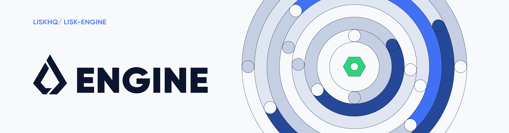

# lisk-engine

[](https://github.com/LiskHQ/lisk-engine/actions/workflows/pr.yaml)


[](http://www.apache.org/licenses/LICENSE-2.0)


## Requirement
- Go v1.21 or above

## Development

### Linting tool
[golangci-lint](https://golangci-lint.run/) is used for linting. To setup the local environment, refer to [integration](https://golangci-lint.run/usage/integrations/) in their documentation.


### Godocs
Run below command to locally view the generated godocs
```
Make godocs
```

### Run lengine against known ABI server
```
make run.lengine PATH_TO_ABI_SERVER PATH_TO_CONFIG

// Example
// make run.lengine path=~/.lisk/dpos-mainchain/tmp/sockets/abi.ipc config=./cmd/debug/app/config.json
```

### Generate new codec
1. Define new struct with tag on each property `fieldNumber: "n"`
2. Add `//go:generate go run github.com/LiskHQ/lisk-engine/pkg/codec/gen` at the top of the file
3. Call `make generate.codec`


### Test
* `make test` - Runs all the tests and shows the summary
* `make test.coverage` - Runs all the tests and shows the detail coverage report
* `make test.coverage.html` - Runs all the tests and produces coverage HTML

## Contributors

https://github.com/LiskHQ/lisk-engine/graphs/contributors

## Disclaimer
By using the beta release of the Lisk Engine, you acknowledge and agree that you have an adequate understanding of the risks associated with the use of the beta release of the Lisk Engine and that it is provided on an “as is” and “as available” basis, without any representations or warranties of any kind. To the fullest extent permitted by law, in no event shall the Lisk Foundation or other parties involved in the development of the beta release of the Lisk Engine have any liability whatsoever to any person for any direct or indirect loss, liability, cost, claim, expense or damage of any kind, whether in contract or in tort, including negligence, or otherwise, arising out of or related to the use of all or part of the Beta release of the Lisk Engine.

## License

Copyright 2022 Lisk Foundation

Licensed under the Apache License, Version 2.0 (the "License");
you may not use this file except in compliance with the License.
You may obtain a copy of the License at

    http://www.apache.org/licenses/LICENSE-2.0

Unless required by applicable law or agreed to in writing, software
distributed under the License is distributed on an "AS IS" BASIS,
WITHOUT WARRANTIES OR CONDITIONS OF ANY KIND, either express or implied.
See the License for the specific language governing permissions and
limitations under the License.
